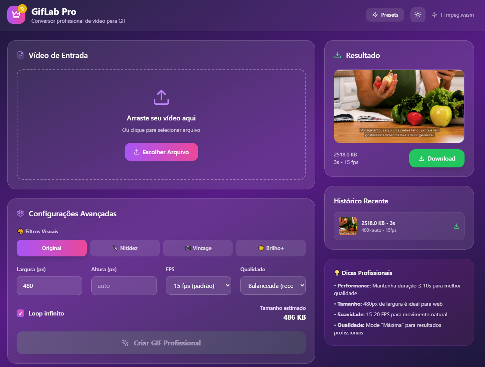

# GifLab Pro 

Professional video to GIF converter with advanced technology.

[](https://github.com/marcostolosa/GifLab/actions)
[](https://gif.mindsecurity.org)



## Features

- Performance optimization powered by FFmpeg.wasm
- Visual filters: sharpness, vintage, brightness enhancement
- Quick presets optimized for social media, web, and HD
- Advanced configuration with full control over quality, FPS, and dimensions
- Responsive design for any device
- Dark/light theme support
- Real-time preview
- Generation history

## Quick Start

### Local Development

```bash
git clone https://github.com/marcostolosa/GifLab.git
cd GifLab
npm install
npm run dev
```

Access: [http://localhost:3000](http://localhost:3000)

### Production Build

```bash
npm run build
npm run preview
```

## Deploy

### GitHub Pages

Automatic deployment via GitHub Actions on every push to main branch.

1. Fork this repository
2. Enable GitHub Pages in repository settings
3. Configure custom domain: gif.mindsecurity.org

## Project Structure

```
GifLab/
├── public/
│   ├── favicon.svg
│   └── CNAME
├── src/
│   ├── App.tsx
│   ├── main.tsx
│   └── index.css
├── .github/workflows/
│   └── deploy.yml
├── package.json
├── vite.config.ts
└── tailwind.config.js
```

## Technologies

- React 18 - UI library
- TypeScript - Static typing
- Vite - Build tool
- TailwindCSS - CSS framework
- FFmpeg.wasm - Video processing
- Lucide React - Icons

## Presets

| Preset | Dimensions | FPS | Use Case |
|--------|-----------|-----|----------|
| Social Media | 480x480 | 15 | Instagram, TikTok |
| Web/Blog | 600x auto | 12 | Websites, blogs |
| High Quality | 720x auto | 20 | Presentations |
| Ultra Light | 320x auto | 10 | WhatsApp, email |

## Visual Filters

- Original - No additional processing
- Sharpness - Improves image definition
- Vintage - Retro/vintage effect
- Brightness+ - Increases brightness and contrast

## Configuration

### CORS Headers

Development server includes required headers:
- Cross-Origin-Embedder-Policy: require-corp
- Cross-Origin-Opener-Policy: same-origin

### Optimizations

- Code splitting for optimized loading
- Lazy loading for FFmpeg
- Asset compression
- Tree shaking

## Performance

- First load: 2-3s (FFmpeg download)
- Subsequent conversions: 5-30s (depends on video)
- Bundle size: ~150KB (without FFmpeg)
- Mobile friendly and responsive

## License

MIT License

## Links

- Live Demo: [gif.mindsecurity.org](https://gif.mindsecurity.org)
- Repository: [github.com/marcostolosa/GifLab](https://github.com/marcostolosa/GifLab)

## Author

Marcos Tolosa
- GitHub: [@marcostolosa](https://github.com/marcostolosa)
- Website: [mindsecurity.org](https://mindsecurity.org)
